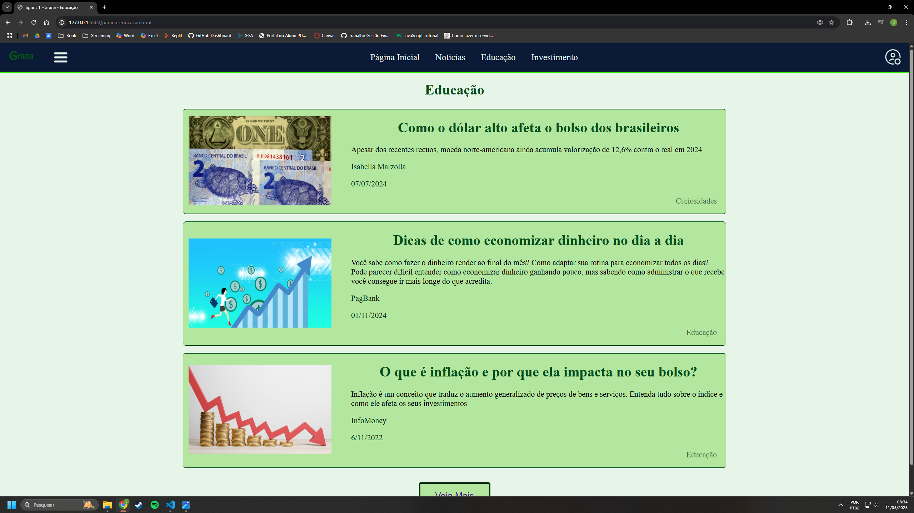
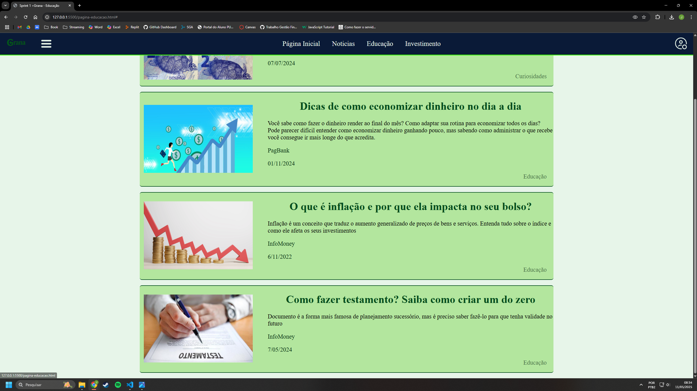
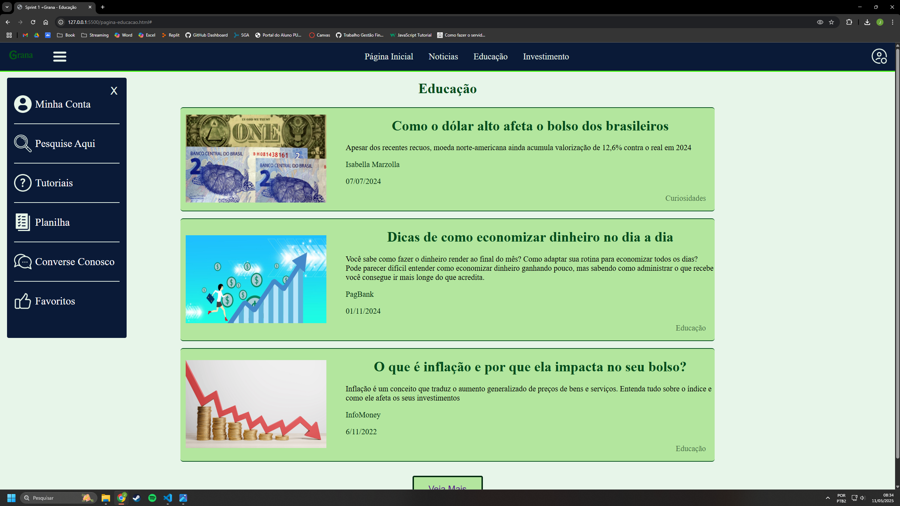

# Sprint 1 #

Aluno: João Vitor Alves Amaral
Matrícula: 882594
Turma: Sistemas de Informação
Turno: Noite
Grupo: +Grana
Projeto: Gestão Financeira
Parte: Desenvolvimento da guia que apresenta notícias que devem ser utilizadas para ensinar gestão financeira ou educar o cliente nessa competência, como por exemplo, como cuidar do seu dinheiro, como dolar influencia na vida, etc...

# Página Inicial # 

# Botão Veja Mais #

# Botão Hamburguer #

# Página De Detalhes #

# Img Favoritar #

# Iframe #

# Comentário #

